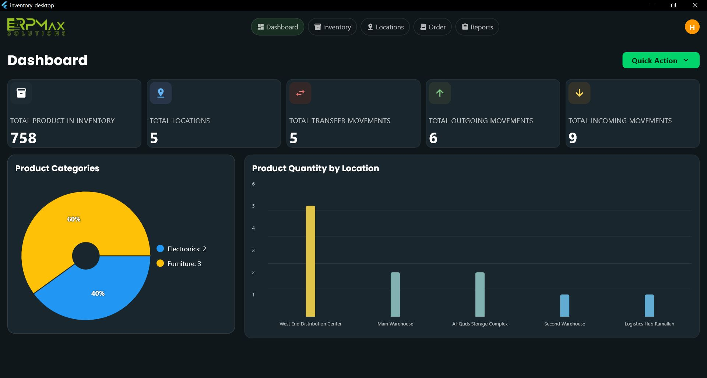
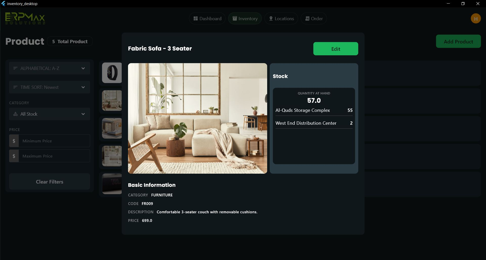
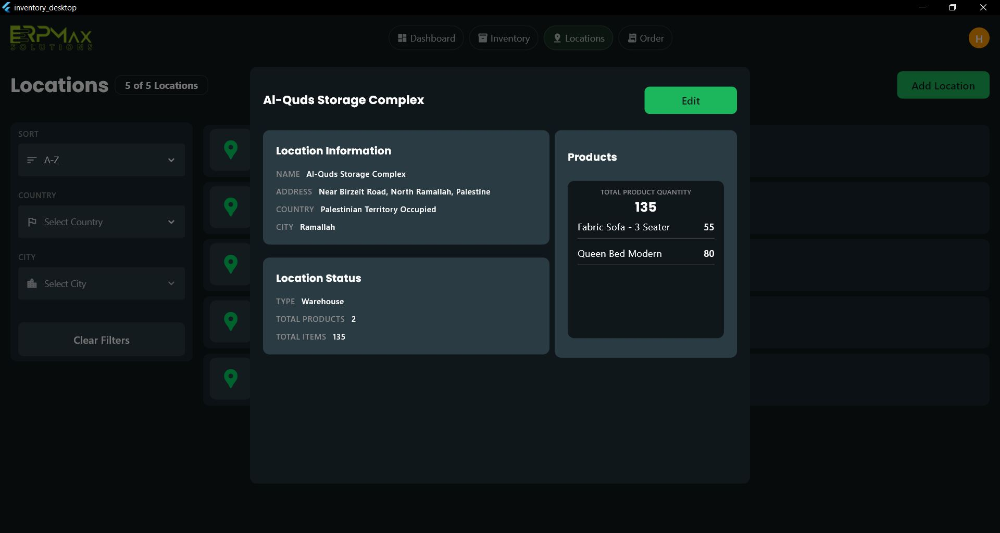

# 📦 Inventory Management System 2025 - Flutter Frontend

## 📋 Project Overview

This Flutter desktop application provides a user-friendly interface for managing inventory products, locations, and movements. It integrates with a RESTful Spring Boot backend to deliver real-time inventory data, analytics, and tracking across multiple locations.

## 🏗️ Architecture

The frontend follows a structured **Provider-based architecture**:

- **Views:** UI screens and widgets  
- **Providers:** State management logic  
- **Controllers:** Bridge between UI and services  
- **Services:** REST API communication  
- **Models:** Data classes for domain objects  
- **Widgets:** Reusable UI components  

## 🔧 Tech Stack

- **Framework:** Flutter 3.19.3  
- **Language:** Dart 3.3.0  
- **State Management:** Provider 6.1.1  
- **API Communication:** http 1.1.0  
- **Visualization:** fl_chart  
- **UI:** Custom dark-themed responsive layout  

## 🚀 Features

### Dashboard

- Total product & location counts  
- Inventory movement stats  
- Product category pie chart  
- Location inventory bar chart  
- Refreshable in real-time  

### Product Management

- filterable product list  
- Add/edit forms with validation  
- Product detail view and providing the Product balance in each location
- Category and status filtering  

### Location Management

- Location list with filters  
- Location inventory breakdown  
- Add/edit/view locations

### Inventory Movements

- IN / OUT / TRANSFER support  
- Filter by movement type, product, location  
- Add/edit/view with validation and rules

### Reports (Product Balance)

- Summary of product balance in all loactions 
- Search for product, location  
- Added pagination

## 📡 API Integration

| Module                | Endpoints Used                                               |
|----------------------|--------------------------------------------------------------|
| ProductService        | `/api/products`, `/api/products/product-balances/{id}`      |
| LocationService       | `/api/locations`, `/api/locations/{id}/inventory`           |
| ProductMovementService| `/api/productMovement`                                      |
| ReportsService        | `/api/reports/dashboard-stats`, `/api/reports/productDistribution` |

## 🛠️ Setup & Installation

### Prerequisites
- Flutter SDK 3.0+  
- Dart 3.0+  
- A running backend (Spring Boot Inventory API)  

### Instructions

# Clone the repository
git clone https://github.com/Hala1mo/inventory_desktop_2025.git

# Navigate to project directory
cd inventory-management-flutter

# Install dependencies
flutter pub get

# Configure backend URL in AppConstants.dart
# static const String serverUrl = 'http://localhost:8081';

# Run the application
flutter run -d windows  # For Windows
flutter run -d macos    # For macOS
flutter run -d linux    # For Linux

## 📈 Analytics

* **Real-time dashboard statistics**
* **Product distribution by category**
* **Location-wise product quantity**
* **Product balances by ID/location**

## 💡 Advanced Capabilities

* **Provider Pattern:** For clean state management
* **Custom Widgets:** Modular, reusable UI components
* **Error Handling:** With user feedback
* **Validation:** Form and input constraints
* **Responsive Design:** Desktop-optimized layouts

## 👩‍💻 Author

### Hala Abdel Halim

Frontend developed  using Flutter for <strong>ERPMax Solutions</strong> 

